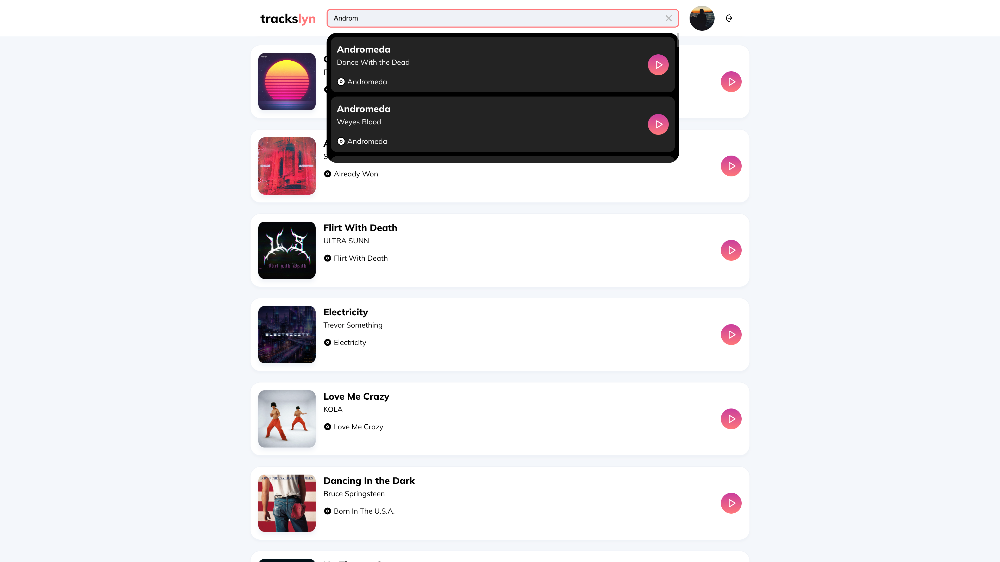
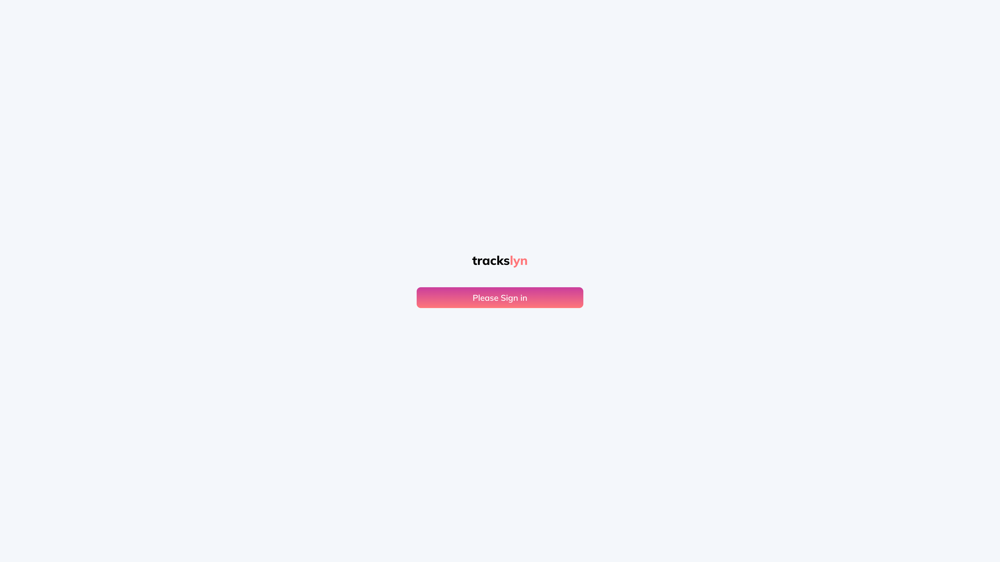

## Screenshots

## Preview
https://trackslyn.yuliia-tkachenko.dev/
(To access the project preview, users must be included in the project's allowlist on Spotify for Developers).

## Description

Web audio player that grants access to a user's Spotify tracks. The project implements a customized audio player designed for playing previews of tracks from the user's library.

## Created with:
React, TypeScript, HTML, SCSS, Spotify API

Designed and developed by Yuliia Tkachenko, 2024