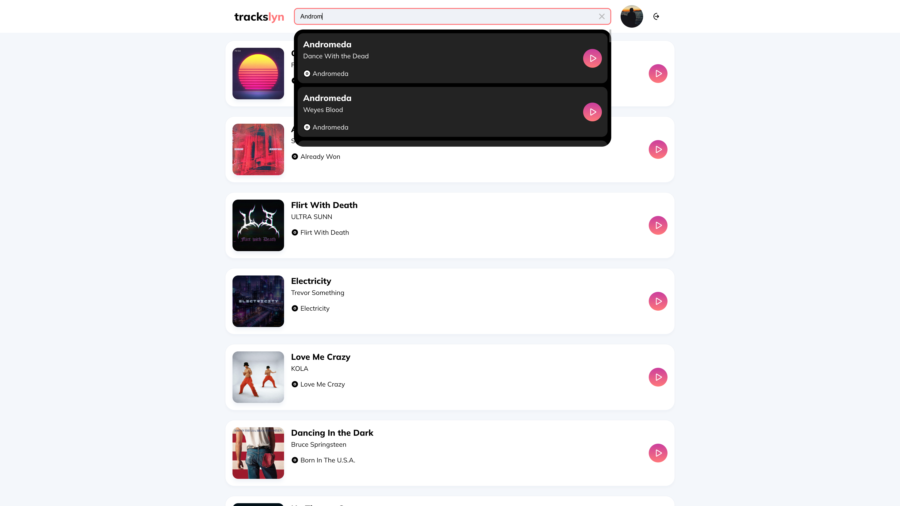
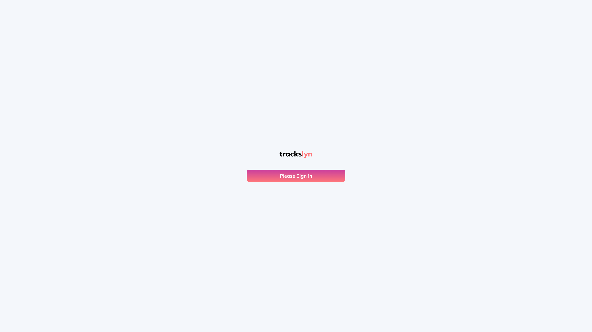

## Screenshots

## Description

A web audio player that connects to a user’s Spotify account and allows playback of track previews through a custom-built player interface.

## Link
https://trackslyn.yuliia-tkachenko.dev
(To access the project preview, users must be included in the project's allowlist on Spotify for Developers).

## Created with:
React, TypeScript, HTML, SCSS, Spotify API

Designed and developed by Yuliia Tkachenko, 2024
